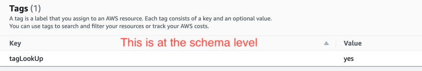
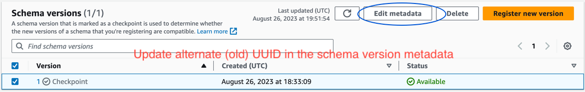
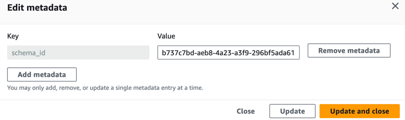

# AWS Glue Schema Registry Library


[](http://aws.amazon.com/apache-2-0/)


**AWS Glue Schema Registry** provides a solution for customers to centrally discover, control and evolve 
schemas while ensuring data produced was validated by registered schemas.
**AWS Glue Schema Registry Library** offers Serializers and Deserializers that plug-in with Glue Schema Registry.

## Getting Started
1. **Sign up for AWS** &mdash; Before you begin, you need an AWS account. For more information about creating an AWS 
account and retrieving your AWS credentials, see [AWS Account and Credentials](https://docs.aws.amazon.com/sdk-for-java/latest/developer-guide/home.html) in the AWS SDK for Java Developer Guide.
1. **Sign up for AWS Glue Schema Registry** &mdash; Go to the AWS Glue Schema Registry console to sign up for the 
service and create an AWS Glue Schema Registry. For more information, see [Getting Started with Glue Schema 
Registry](https://docs.aws.amazon.com/glue/latest/dg/schema-registry-gs.html) in the AWS Glue Developer Guide.
1. **Minimum requirements** &mdash; To use the AWS Glue Schema Registry, you'll need **Java > 1.8 and < Java 15**.

## Features

1. Messages/records are serialized on producer front and deserialized on the consumer front by using 
schema-registry-serde.
1. Support for three data formats: AVRO, JSON (with [JSON Schema](https://json-schema.org/) Draft04, Draft06, Draft07), and Protocol Buffers (Protobuf syntax versions 2 and 3).
1. Kafka Streams support for AWS Glue Schema Registry.
1. Records can be compressed to reduce message size.
1. An inbuilt local in-memory cache to save calls to AWS Glue Schema Registry. The schema version id for a schema 
definition is cached on Producer side and schema for a schema version id is cached on the Consumer side.
1. Auto registration of schema can be enabled for any new schema to be auto-registered.
1. For Schemas, Evolution check is performed while registering.
1. Migration from a third party Schema Registry.
1. [Flink support](https://ci.apache.org/projects/flink/flink-docs-release-1.14/docs/connectors/datastream/kafka/) for
 AWS Glue Schema Registry.
1. Kafka Connect support for AWS Glue Schema Registry.

## Building from Source

After you've downloaded the code from GitHub, you can build it using Maven.

The following maven command will clean the target directory, compile the project, execute the tests and package the project build into a JAR.

`cd build-tools/ && mvn clean install && cd .. && mvn clean install`

Alternatively, one could git clone this repo and run ``mvn clean install``.

## Testing

To simply run the tests, execute the following maven command: 

`mvn test`

## Using the AWS Glue Schema Registry Library Serializer / Deserializer
The recommended way to use the AWS Glue Schema Registry Library for Java is to consume it from Maven.

**Using AWS Glue Schema Registry with Amazon MSK** &mdash; To set-up Amazon Managed Streaming for Apache Kafka see 
[Getting started with Amazon MSK.](https://docs.aws.amazon.com/msk/latest/developerguide/getting-started.html)

### Maven Dependency
  ``` xml
  <dependency>
      <groupId>software.amazon.glue</groupId>
      <artifactId>schema-registry-serde</artifactId>
      <version>1.1.24</version>
  </dependency>
  ```
### Code Example

#### Producer for Kafka with AVRO format

```java
        properties.put(ProducerConfig.KEY_SERIALIZER_CLASS_CONFIG, StringSerializer.class.getName());
        properties.put(ProducerConfig.VALUE_SERIALIZER_CLASS_CONFIG, GlueSchemaRegistryKafkaSerializer.class.getName());
        properties.put(AWSSchemaRegistryConstants.DATA_FORMAT, DataFormat.AVRO.name());
        properties.put(AWSSchemaRegistryConstants.AWS_REGION, "us-east-1");
        properties.put(AWSSchemaRegistryConstants.REGISTRY_NAME, "my-registry");
        properties.put(AWSSchemaRegistryConstants.SCHEMA_NAME, "my-schema");

        Schema schema_payment = null;
        try {
            schema_payment = parser.parse(new File("src/main/resources/avro/com/tutorial/Payment.avsc"));
        } catch (IOException e) {
            e.printStackTrace();
        }
        
        GenericRecord musical = new GenericData.Record(schema_payment);
        musical.put("id", "entertainment_2");
        musical.put("amount", 105.0);

        List<GenericRecord> misc = new ArrayList<>();
        misc.add(musical);

        try (KafkaProducer<String, GenericRecord> producer = new KafkaProducer<String, GenericRecord>(properties)) {
            for (int i = 0; i < 4; i++) {
                GenericRecord r = misc.get(i);

                final ProducerRecord<String, GenericRecord> record;
                record = new ProducerRecord<String, GenericRecord>(topic, r.get("id").toString(), r);

                producer.send(record);
                System.out.println("Sent message " + i);
                Thread.sleep(1000L);
            }
            producer.flush();
            System.out.println("Successfully produced 10 messages to a topic called " + topic);

        } catch (final InterruptedException | SerializationException e) {
            e.printStackTrace();
        }
```

#### Consumer for Kafka with AVRO format

```java
        properties.put(ConsumerConfig.KEY_DESERIALIZER_CLASS_CONFIG, StringDeserializer.class.getName());
        properties.put(ConsumerConfig.VALUE_DESERIALIZER_CLASS_CONFIG, GlueSchemaRegistryKafkaDeserializer.class
        .getName();
        properties.put(AWSSchemaRegistryConstants.AWS_REGION, "us-east-1");
        properties.put(AWSSchemaRegistryConstants.AVRO_RECORD_TYPE, AvroRecordType.GENERIC_RECORD.getName());
        
        try (final KafkaConsumer<String, GenericRecord> consumer = new KafkaConsumer<String, GenericRecord>(properties)) {
            consumer.subscribe(Collections.singletonList(topic));

            while (true) {
                final ConsumerRecords<String, GenericRecord> records = consumer.poll(100);
                for (final ConsumerRecord<String, GenericRecord> record : records) {
                    final String key = record.key();
                    final GenericRecord value = record.value();
                    System.out.println("Received message: key = " + key + ", value = " + value);
                }
            }
        }

```

#### Producer for Kafka with JSON format

```java
        properties.put(ProducerConfig.KEY_SERIALIZER_CLASS_CONFIG, StringSerializer.class.getName());
        properties.put(ProducerConfig.VALUE_SERIALIZER_CLASS_CONFIG, GlueSchemaRegistryKafkaSerializer.class.getName());
        properties.put(AWSSchemaRegistryConstants.DATA_FORMAT, DataFormat.JSON.name());
        properties.put(AWSSchemaRegistryConstants.AWS_REGION, "us-east-1");
        properties.put(AWSSchemaRegistryConstants.REGISTRY_NAME, "my-registry");
        properties.put(AWSSchemaRegistryConstants.SCHEMA_NAME, "my-schema");
        
        String jsonSchema = "{\n" + "        \"$schema\": \"http://json-schema.org/draft-04/schema#\",\n"
                                                + "        \"type\": \"object\",\n" + "        \"properties\": {\n" + "          \"employee\": {\n"
                                                + "            \"type\": \"object\",\n" + "            \"properties\": {\n"
                                                + "              \"name\": {\n" + "                \"type\": \"string\"\n" + "              },\n"
                                                + "              \"age\": {\n" + "                \"type\": \"integer\"\n" + "              },\n"
                                                + "              \"city\": {\n" + "                \"type\": \"string\"\n" + "              }\n"
                                                + "            },\n" + "            \"required\": [\n" + "              \"name\",\n"
                                                + "              \"age\",\n" + "              \"city\"\n" + "            ]\n" + "          }\n"
                                                + "        },\n" + "        \"required\": [\n" + "          \"employee\"\n" + "        ]\n"
                                                + "      }";
        String jsonPayload = "{\n" + "        \"employee\": {\n" + "          \"name\": \"John\",\n" + "          \"age\": 30,\n"
                                                 + "          \"city\": \"New York\"\n" + "        }\n" + "      }";
        
        JsonDataWithSchema jsonSchemaWithData = JsonDataWithSchema.builder(jsonSchema, jsonPayload).build();

        List<JsonDataWithSchema> genericJsonRecords = new ArrayList<>();
        genericJsonRecords.add(jsonSchemaWithData);
        
        try (KafkaProducer<String, JsonDataWithSchema> producer = new KafkaProducer<String, JsonDataWithSchema>(properties)) {
            for (int i = 0; i < genericJsonRecords.size(); i++) {
                JsonDataWithSchema r = genericJsonRecords.get(i);

                final ProducerRecord<String, JsonDataWithSchema> record;
                record = new ProducerRecord<String, JsonDataWithSchema>(topic, "message-" + i, r);

                producer.send(record);
                System.out.println("Sent message " + i);
                Thread.sleep(1000L);
            }
            producer.flush();
            System.out.println("Successfully produced 10 messages to a topic called " + topic);

        } catch (final InterruptedException | SerializationException e) {
            e.printStackTrace();
        }
```

#### Consumer for Kafka with JSON format

```java
        properties.put(ConsumerConfig.KEY_DESERIALIZER_CLASS_CONFIG, StringDeserializer.class.getName());
        properties.put(ConsumerConfig.VALUE_DESERIALIZER_CLASS_CONFIG, GlueSchemaRegistryKafkaDeserializer.class
        .getName();
        properties.put(AWSSchemaRegistryConstants.AWS_REGION, "us-east-1");
        
        try (final KafkaConsumer<String, JsonDataWithSchema> consumer = new KafkaConsumer<String, JsonDataWithSchema>(properties)) {
            consumer.subscribe(Collections.singletonList(topic));

            while (true) {
                final ConsumerRecords<String, JsonDataWithSchema> records = consumer.poll(100);
                for (final ConsumerRecord<String, JsonDataWithSchema> record : records) {
                    final String key = record.key();
                    final JsonDataWithSchema value = record.value();
                    System.out.println("Received message: key = " + key + ", value = " + value);
                }
            }
        }

```

#### Producer for Kafka with PROTOBUF format

```java
        properties.put(ProducerConfig.KEY_SERIALIZER_CLASS_CONFIG, StringSerializer.class.getName());
        properties.put(ProducerConfig.VALUE_SERIALIZER_CLASS_CONFIG, GlueSchemaRegistryKafkaSerializer.class.getName());
        properties.put(AWSSchemaRegistryConstants.DATA_FORMAT, DataFormat.PROTOBUF.name());
        properties.put(AWSSchemaRegistryConstants.AWS_REGION, "us-east-1");
        properties.put(AWSSchemaRegistryConstants.REGISTRY_NAME, "my-registry");
        properties.put(AWSSchemaRegistryConstants.SCHEMA_NAME, "protobuf-file-name.proto")

        // POJO production

        // CustomerAddress is the generated Protocol Buffers class based on the given Protobuf schema definition
        CustomerAddress customerAddress = CustomerAddress.newBuilder().build();
        
        KafkaProducer<String, CustomerAddress> producer = 
             new KafkaProducer<String, CustomerAddress>(properties);
             
        producer.send(customerAddress);
        
        // DynamicMessage production

        DynamicMesssage customerDynamicMessage = 
             DynamicMessage.newBuilder(CustomerAddress.getDescriptor()).build();

        KafkaProducer<String, DynamicMesssage> producer = 
             new KafkaProducer<String, DynamicMesssage>(properties);
        
        producer.send(customerDynamicMessage);

```

#### Consumer for Kafka with PROTOBUF format

```java
        properties.put(ConsumerConfig.KEY_DESERIALIZER_CLASS_CONFIG, StringDeserializer.class.getName());
        properties.put(ConsumerConfig.VALUE_DESERIALIZER_CLASS_CONFIG, GlueSchemaRegistryKafkaDeserializer.class.getName());
        properties.put(AWSSchemaRegistryConstants.AWS_REGION, "us-east-1");

        // POJO consumption
        
        properties.put(AWSSchemaRegistryConstants.PROTOBUF_MESSAGE_TYPE, ProtobufMessageType.POJO.getName());
        
        KafkaConsumer<String, CustomerAddress> consumer = 
             new KafkaConsumer<String, CustomerAddress>(properties)
        
        consumer.subscribe(Collections.singletonList(topic));
        
        final ConsumerRecords<String, CustomerAddress> records = consumer.poll(10);
        records
            .stream()
            .forEach(record -> processRecord(record))
            
        // DynamicMessage consumption

        // This is optional. By default AWSSchemaRegistryConstants.PROTOBUF_MESSAGE_TYPE is set as ProtobufMessageType.DYNAMIC_MESSAGE.getName()
        properties.put(AWSSchemaRegistryConstants.PROTOBUF_MESSAGE_TYPE, ProtobufMessageType.DYNAMIC_MESSAGE.getName());
        
        KafkaConsumer<String, DynamicMessage> consumer = 
             new KafkaConsumer<String, DynamicMesssage>(properties)
        
        consumer.subscribe(Collections.singletonList(topic));
        
        final ConsumerRecords<String, DynamicMessage> records = consumer.poll(10);
        records
            .stream()
            .forEach(record -> processRecord(record))

```

### Dealing with Specific Record (JAVA POJO) for JSON

You could use a Java POJO and pass the object as a record.
We use [mbknor-jackson-jsonschema](https://github.com/mbknor/mbknor-jackson-jsonSchema) to generate a JSON Schema for
 the POJO passed. This library can also inject additional information in the JSON Schema.
 
 **GSR Library uses the "className" to fully classified class name to deserialize back to an Object of the POJO**

Example class :

```java

@JsonSchemaDescription("This is a car")
@JsonSchemaTitle("Simple Car Schema")
@Builder
@AllArgsConstructor
@EqualsAndHashCode
// Fully qualified class name to be added to an additionally injected property
// called className for deserializer to determine which class to deserialize
// the bytes into
@JsonSchemaInject(
        strings = {@JsonSchemaString(path = "className",
                value = "com.amazonaws.services.schemaregistry.integrationtests.generators.Car")}
)
// List of annotations to help infer JSON Schema are defined by https://github.com/mbknor/mbknor-jackson-jsonSchema
public class Car {
    @JsonProperty(required = true)
    private String make;

    @JsonProperty(required = true)
    private String model;

    @JsonSchemaDefault("true")
    @JsonProperty
    public boolean used;

    @JsonSchemaInject(ints = {@JsonSchemaInt(path = "multipleOf", value = 1000)})
    @Max(200000)
    @JsonProperty
    private int miles;

    @Min(2000)
    @JsonProperty
    private int year;

    @JsonProperty
    private Date purchaseDate;

    @JsonProperty
    @JsonFormat(shape = JsonFormat.Shape.NUMBER)
    private Date listedDate;

    @JsonProperty
    private String[] owners;

    @JsonProperty
    private Collection<Float> serviceChecks;

    // Empty constructor is required by Jackson to deserialize bytes
    // into an Object of this class
    public Car() {}
}

```

### Using AWS Glue Schema Registry with Kinesis Data Streams

**Kinesis Client library (KCL) / Kinesis Producer Library (KPL):** [Getting started with AWS Glue Schema Registry with AWS Kinesis Data Streams](https://docs.aws.amazon.com/glue/latest/dg/schema-registry-integrations.html#schema-registry-integrations-kds)

If you cannot use KCL / KPL libraries for Kinesis Data Streams integration,
**See [examples](examples/) and [integration-tests](integration-tests/) for working example with Kinesis SDK, KPL and 
KCL.


### Using Auto-Registration

Auto-Registration allows any record produced with new schema to be automatically registered with the AWS Glue Schema 
Registry. The Schema is registered automatically and a new schema version is created and evolution checks are performed.

If the Schema already exists, but the schema version is new, the new schema version is created and evolution checks are performed. 

Auto-Registration is disabled by default. To enable Auto-Registration, enable setting by passing the configuration to
 the Producer as below :

```java
    properties.put(AWSSchemaRegistryConstants.SCHEMA_AUTO_REGISTRATION_SETTING, true); // If not passed, defaults to false
```

### Providing Registry Name

Registry Name can be provided by setting this property - 

```java
    properties.put(AWSSchemaRegistryConstants.REGISTRY_NAME, "my-registry"); // If not passed, uses "default-registry"
```

### Providing Schema Name

Schema Name can be provided by setting this property - 

```java
    properties.put(AWSSchemaRegistryConstants.SCHEMA_NAME, "my-schema"); // If not passed, uses transport name (topic name in case of Kafka)
```

Alternatively, a schema registry naming strategy implementation can be provided.
```java
    properties.put(AWSSchemaRegistryConstants.SCHEMA_NAMING_GENERATION_CLASS,
                    "com.amazonaws.services.schemaregistry.serializers.avro.CustomerProvidedSchemaNamingStrategy");
```
An example test implementation class is [here](https://github.com/awslabs/aws-glue-schema-registry/blob/master/serializer-deserializer/src/test/java/com/amazonaws/services/schemaregistry/serializers/avro/CustomerProvidedSchemaNamingStrategy.java).

### Providing Registry Description

Registry Description can be provided by setting this property - 

```java
    properties.put(AWSSchemaRegistryConstants.DESCRIPTION, "This registry is used for several purposes."); // If not passed, constructs a description
```

### Providing Compatibility Setting for Schema

Registry Description can be provided by setting this property - 

```java
    properties.put(AWSSchemaRegistryConstants.COMPATIBILITY_SETTING, Compatibility.FULL); // Pass a compatibility mode. If not passed, uses Compatibility.BACKWARD
```

### Using Compression

Deserialized byte array can be compressed to save on data usage over the network and storage on the topic/stream. The 
Consumer side using AWS Glue Schema Registry Deserializer would be able to decompress and deserialize the byte array.
By default, compression is disabled. Customers can choose ZLIB as compressionType by setting up below property.

```java
    // If not passed, defaults to no compression
    properties.put(AWSSchemaRegistryConstants.COMPRESSION_TYPE, AWSSchemaRegistryConstants.COMPRESSION.ZLIB.name());
```

### In-Memory Cache settings

In Memory cache is used by Producer to store schema to schema version id mapping and by consumer to store schema 
version id to schema mapping. This cache allows Producers and Consumers to save time and hits on IO calls to Schema 
Registry.

The cache is available by default. However, it can be fine-tuned by providing cache specific properties.

```java
    properties.put(AWSSchemaRegistryConstants.CACHE_TIME_TO_LIVE_MILLIS, "60000"); // If not passed, defaults to 24 Hours
    properties.put(AWSSchemaRegistryConstants.CACHE_SIZE, "100"); // Maximum number of elements in a cache - If not passed, defaults to 200
```

### Migrating from a third party Schema Registry

To migrate to AWS Glue Schema Registry from a third party schema registry for AVRO data types for Kafka, add this 
property for value class along with the third party jar.

```java
    properties.put(AWSSchemaRegistryConstants.SECONDARY_DESERAILIZER, <ThirdPartyKafkaDeserializer>);
```

### Using Kafka Connect with AWS Glue Schema Registry

* Clone this repo, build and copy dependencies

```java
git clone git@github.com:awslabs/aws-glue-schema-registry.git
cd aws-glue-schema-registry
cd build-tools
mvn clean install
cd ..
mvn clean install
mvn dependency:copy-dependencies
```

* Configure Kafka Connectors with following properties

When configuring Kafka Connect workers or connectors, use the value of the string constant properties in the [AWSSchemaRegistryConstants](https://github.com/awslabs/aws-glue-schema-registry/blob/master/common/src/main/java/com/amazonaws/services/schemaregistry/utils/AWSSchemaRegistryConstants.java#L20) class to configure the AWSKafkaAvroConverter.

```java
    key.converter=com.amazonaws.services.schemaregistry.kafkaconnect.AWSKafkaAvroConverter
    value.converter=com.amazonaws.services.schemaregistry.kafkaconnect.AWSKafkaAvroConverter
    key.converter.region=ca-central-1
    value.converter.region=ca-central-1
    key.converter.schemaAutoRegistrationEnabled=true
    value.converter.schemaAutoRegistrationEnabled=true
    key.converter.avroRecordType=GENERIC_RECORD
    value.converter.avroRecordType=GENERIC_RECORD
    key.converter.schemaName=KeySchema
    value.converter.schemaName=ValueSchema
```

As Glue Schema Registry is a fully managed service by AWS, there is no notion of schema registry URLs. Name of the registry (within the same AWS account) can be optionally configured using following options. If not specified, default-registry is used.

```java
    key.converter.registry.name=my-registry
    value.converter.registry.name=my-registry
```

* Add command below to *Launch mode* section under *kafka-run-class.sh*

``` 
-cp $CLASSPATH:"<your aws glue schema registry base directory>/target/dependency/*" 
```

It should look like this

```
    # Launch mode
    if [ "x$DAEMON_MODE" = "xtrue" ]; then
      nohup "$JAVA" $KAFKA_HEAP_OPTS $KAFKA_JVM_PERFORMANCE_OPTS $KAFKA_GC_LOG_OPTS $KAFKA_JMX_OPTS $KAFKA_LOG4J_OPTS -cp $CLASSPATH:"/Users/johndoe/aws-glue-schema-registry/target/dependency/*" $KAFKA_OPTS "$@" > "$CONSOLE_OUTPUT_FILE" 2>&1 < /dev/null &
    else
      exec "$JAVA" $KAFKA_HEAP_OPTS $KAFKA_JVM_PERFORMANCE_OPTS $KAFKA_GC_LOG_OPTS $KAFKA_JMX_OPTS $KAFKA_LOG4J_OPTS -cp $CLASSPATH:"/Users/johndoe/aws-glue-schema-registry/target/dependency/*" $KAFKA_OPTS "$@"
    fi
```

* If using bash, run the below commands to set-up your CLASSPATH in your bash_profile. (For any other shell, update the environment accordingly.)
  ```bash
      echo 'export GSR_LIB_BASE_DIR=<>' >>~/.bash_profile
      echo 'export GSR_LIB_VERSION=1.1.24' >>~/.bash_profile
      echo 'export KAFKA_HOME=<your kafka installation directory>' >>~/.bash_profile
      echo 'export CLASSPATH=$CLASSPATH:$GSR_LIB_BASE_DIR/avro-kafkaconnect-converter/target/schema-registry-kafkaconnect-converter-$GSR_LIB_VERSION.jar:$GSR_LIB_BASE_DIR/common/target/schema-registry-common-$GSR_LIB_VERSION.jar:$GSR_LIB_BASE_DIR/avro-serializer-deserializer/target/schema-registry-serde-$GSR_LIB_VERSION.jar' >>~/.bash_profile
      source ~/.bash_profile
    ```
* (Optional) If you wish to test with a simple file source then clone the file source connector.
  
  ```bash
      git clone https://github.com/mmolimar/kafka-connect-fs.git
      cd kafka-connect-fs/
    ```
  
  Under source connector configuration(config/kafka-connect-fs.properties), edit the data format to Avro, file reader 
  to AvroFileReader and update an 
  example Avro object from the file path you are reading from. For example:
  
  ```
      fs.uris=<path to a sample avro object>
      policy.regexp=^.*\.avro$
      file_reader.class=com.github.mmolimar.kafka.connect.fs.file.reader.AvroFileReader
  ```
  
  Install source connector
  
  ```
      mvn clean package
      echo "export CLASSPATH=\$CLASSPATH:\"\$(find target/ -type f -name '*.jar'| grep '\-package' | tr '\n' ':')\"" >>~/.bash_profile
      source ~/.bash_profile
  ```
  
  Update the sink properties under *<your Apache Kafka installation directory>/config/connect-file-sink.properties*
  
  ```
  file=<output file full path>
  topics=<my topic>
  ```
  
  Start Source Connector (In this example it is file source connector)
  
  ```
  $KAFKA_HOME/bin/connect-standalone.sh $KAFKA_HOME/config/connect-standalone.properties config/kafka-connect-fs.properties
  ```
 
  Run Sink Connector (In this example it is file sink connector))
  
  ```
  $KAFKA_HOME/bin/connect-standalone.sh $KAFKA_HOME/config/connect-standalone.properties $KAFKA_HOME/config/connect-file-sink.properties
  ```

* For more examples for running Kafka Connect with Avro, JSON, and Protobuf formats, refer script **run-local-tests.sh** under
**integration-tests** module.

### Using Kafka Streams with AWS Glue Schema Registry

### Maven Dependency
  ``` xml
  <dependency>
        <groupId>software.amazon.glue</groupId>
        <artifactId>schema-registry-kafkastreams-serde</artifactId>
        <version>1.1.24</version>
  </dependency>
  ```

```java
    final Properties props = new Properties();
    props.put(StreamsConfig.APPLICATION_ID_CONFIG, "avro-streams");
    props.put(StreamsConfig.BOOTSTRAP_SERVERS_CONFIG, "localhost:9092");
    props.put(StreamsConfig.CACHE_MAX_BYTES_BUFFERING_CONFIG, 0);
    props.put(StreamsConfig.DEFAULT_KEY_SERDE_CLASS_CONFIG, Serdes.String().getClass().getName());
    props.put(StreamsConfig.DEFAULT_VALUE_SERDE_CLASS_CONFIG, AWSKafkaAvroSerDe.class.getName());
    props.put(ConsumerConfig.AUTO_OFFSET_RESET_CONFIG, "earliest");
    
    props.put(AWSSchemaRegistryConstants.AWS_REGION, "us-east-1");
    props.put(AWSSchemaRegistryConstants.SCHEMA_AUTO_REGISTRATION_SETTING, true);
    props.put(AWSSchemaRegistryConstants.AVRO_RECORD_TYPE, AvroRecordType.GENERIC_RECORD.getName());

    StreamsBuilder builder = new StreamsBuilder();
    final KStream<String, GenericRecord> source = builder.stream("avro-input");
    final KStream<String, GenericRecord> result = source
        .filter((key, value) -> !"pink".equals(String.valueOf(value.get("favorite_color"))));
        .filter((key, value) -> !"15.0".equals(String.valueOf(value.get("amount"))));
    result.to("avro-output");

    KafkaStreams streams = new KafkaStreams(builder.build(), props);
    streams.start();
```

## Using the AWS Glue Schema Registry Flink Connector

AWS Glue Schema Registry Flink Connector for Java in this repository is not recommended. Please check out [Apache Flink](https://github.com/apache/flink) 
repository for the latest support: [Avro SerializationSchema and DeserializationSchema](https://github.com/apache/flink/tree/master/flink-formats/flink-avro-glue-schema-registry) and [JSON SerializationSchema and DeserializationSchema](https://github.com/apache/flink/tree/master/flink-formats/flink-json-glue-schema-registry). Protobuf integration will be followed up soon.

### Maven Dependency
  ``` xml
  <dependency>
       <groupId>software.amazon.glue</groupId>
       <artifactId>schema-registry-flink-serde</artifactId>
       <version>1.1.24</version>
  </dependency>
  ```
### Code Example

#### Flink Kafka Producer with AVRO format

```java
    String topic = "topic";
    Properties properties = new Properties();
    properties.setProperty("bootstrap.servers", "localhost:9092");
    properties.setProperty("group.id", "test");

    Map<String, Object> configs = new HashMap<>();
    configs.put(AWSSchemaRegistryConstants.AWS_REGION, "us-east-1");
    configs.put(AWSSchemaRegistryConstants.SCHEMA_AUTO_REGISTRATION_SETTING, true);

    Schema.Parser parser = new Schema.Parser();
    Schema schema = parser.parse(new File("path/to/avro/file"));

    FlinkKafkaProducer<GenericRecord> producer = new FlinkKafkaProducer<>(
            topic,
            GlueSchemaRegistryAvroSerializationSchema.forGeneric(schema, topic, configs),
            properties);
    stream.addSink(producer);
```

#### Flink Kafka Consumer with AVRO format

```java
    String topic = "topic";
    Properties properties = new Properties();
    properties.setProperty("bootstrap.servers", "localhost:9092");
    properties.setProperty("group.id", "test");

    Map<String, Object> configs = new HashMap<>();
    configs.put(AWSSchemaRegistryConstants.AWS_REGION, "us-east-1");
    configs.put(AWSSchemaRegistryConstants.AVRO_RECORD_TYPE, AvroRecordType.GENERIC_RECORD.getName());

    Schema.Parser parser = new Schema.Parser();
    Schema schema = parser.parse(new File("path/to/avro/file"));

    FlinkKafkaConsumer<GenericRecord> consumer = new FlinkKafkaConsumer<>(
            topic,
            GlueSchemaRegistryAvroDeserializationSchema.forGeneric(schema, configs),
            properties);
    DataStream<GenericRecord> stream = env.addSource(consumer);
```
## Tag-Based Schema Version Lookup
We have introduced a tag-based lookup feature to efficiently retrieve schema versions in AWS Glue. This allows for faster retrieval of schema versions by utilizing metadata tags associated with the schemas.

How it works:
When a schema is registered, it can be tagged with metadata.
During retrieval, if the schema version isn't found in the cache, the system will attempt to find the schema using the specified metadata tags provided by
tagBasedLookupKeyName and tagBasedLookupKeyValue parameter. 

This reduces the need for extensive lookups, optimizing the schema retrieval process.
Configuration:
To enable tag-based lookup:

Set useTagBasedLookup to true in your configuration.

Use tagBasedLookupKeyName and tagBasedLookupKeyValue to search for schema version in the scheams with the following tags
if tagBasedLookupKeyName is tagLookUp and  tagBasedLookupKeyValue is yes, then this needs to be stored at the schema level.


Provide the metadataTagKeyName with original schema version uuid, which will be used as the lookup key.





Please note that proper and correct tagging of schemas is essential for this feature to work efficiently.


 ## Security issue notifications
If you discover a potential security issue in this project we ask that you notify AWS/Amazon Security via our [vulnerability reporting page](http://aws.amazon.com/security/vulnerability-reporting/). Please do **not** create a public github issue.
